# LandLens 🌍🔍 — AI-Powered Government Land Verification & Citizen Fraud Prevention Platform

[](https://skillsbuild.org/)
[](#)
[](https://adoptium.net/)
[](https://spring.io/projects/spring-boot)
[](https://react.dev/)
[](https://www.typescriptlang.org/)
[](https://www.docker.com/)
[](https://aws.amazon.com/)
[](https://www.mysql.com/)

> **Tagline:** *"LandLens: Making Land Verification Accessible, Transparent, and AI-Assisted for Every Citizen."*

<p align="center">
  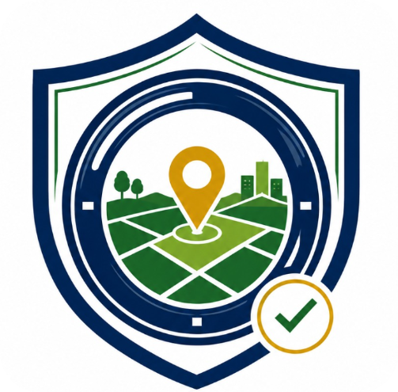
</p>

<p align="center">
  <a href="https://dpyyh7torlown.cloudfront.net">
    
  </a>
</p>

### 🌐 **Live Production Web Portal:** [https://dpyyh7torlown.cloudfront.net](https://dpyyh7torlown.cloudfront.net)

---

## 🏛️ IBM Hackathon Track & Positioning Overview

| Dimension | Details |
| :--- | :--- |
| **Project Title** | **LandLens – AI-Powered Government Land Verification & Citizen Fraud Prevention Platform** |
| **Primary Track** | **AI for Impact – Governance & Citizen Services** |
| **Core Value** | AI-assisted citizen and government service that simplifies land verification, improves public-service accessibility, and prevents property fraud. |
| **Responsible AI** | **AI Analyzes + AI Explains + AI Flags Risks + AI Assists Officers + Humans Make the Final Decision.** |
| **Multilingual AI** | Native conversational support in English and regional Indian languages (**తెలుగు, हिन्दी, தமிழ், ಕನ್ನಡ, मराठी, বাংলা**). |

---

## 📑 Master Table of Contents
1. [Primary Problem Statement](#1-primary-problem-statement)
2. [Proposed IBM Hackathon Solution & Capabilities](#2-proposed-ibm-hackathon-solution--capabilities)
3. [Citizen Service Workflow & Architecture](#3-citizen-service-workflow--architecture)
4. [IBM AI Integration & Key Features](#4-ibm-ai-integration--key-features)
5. [End-to-End Demo Story](#5-end-to-end-demo-story)
6. [IBM Hackathon Value Proposition](#6-ibm-hackathon-value-proposition)
7. [Application Screenshots & UI Showcase](#7-application-screenshots--ui-showcase)
8. [Team Members & Key Contributions](#8-team-members--key-contributions)
9. [Complete Technology Stack by Service](#9-complete-technology-stack-by-service)
10. [System Architecture & Sequence Diagrams](#10-system-architecture--sequence-diagrams)
11. [Database Module Overview & ERD](#11-database-module-overview--erd)
12. [Complete REST API Directory](#12-complete-rest-api-directory)
13. [Local Development & Setup Guide](#13-local-development--setup-guide)
14. [Security, Auth & Rate Limiting](#14-security-auth--rate-limiting)
15. [Scalability, Cloud & Future Roadmap](#15-scalability-cloud--future-roadmap)

---

## 1. Primary Problem Statement

> *"Citizens often struggle to understand and verify land ownership documents, while government authorities face time-consuming manual processes for validating property claims, detecting duplicate land boundaries, and investigating potentially fraudulent documents. LandLens uses AI-assisted document analysis, GIS-based overlap detection, risk scoring, multilingual assistance, and government verification workflows to make land verification more accessible, transparent, and efficient for citizens and public authorities."*

### Key Challenges Addressed:
* 📄 **Complicated Legal Documents**: Non-technical citizens and rural farmers struggle to understand complex revenue jargon in Patta deeds, 1B records, and Encumbrance Certificates.
* ⚠️ **Forged Land Deeds & Double Selling**: Malicious actors create duplicate or altered land documents, leading to overlapping boundary conflicts and litigation.
* ⏳ **Manual Government Bottlenecks**: Public land officers and surveyors spend weeks on manual document validation and physical site visits.
* 🌐 **Language & Digital Inclusion Barriers**: Lack of regional-language AI assistance prevents non-English-speaking citizens from accessing public land intelligence.

---

## 2. Proposed IBM Hackathon Solution & Capabilities

**LandLens** delivers a production-grade AI-assisted government land verification ecosystem through 12 core capabilities:

1. 📥 **Multi-Document Ingestion**: Accepts Patta, title deeds, tax receipts, and survey certificates.
2. 👁️ **AI/OCR Document Intelligence**: Extracts survey numbers, ownership names, demarcated boundaries, and land acreage.
3. 🔍 **Forgery & Inconsistency Analysis**: Automatically detects altered numbers, mismatched seals, and ledger discrepancies.
4. 🗄️ **Public Registry Cross-Referencing**: Matches submitted property claims with state revenue and sub-registrar databases.
5. 🗺️ **GIS Spatial Overlap Detection**: Uses Mapbox GL JS polygon clustering and coordinate intersection to detect overlapping land claims.
6. 🛡️ **AI Land Trust/Risk Scoring**: Calculates composite risk scores with detailed explanatory factors (e.g., 88/100).
7. 🗣️ **Citizen-Friendly Plain Explanations**: Translates legal terminology into simple, non-jargon language.
8. 👨‍💼 **Government Officer AI Copilot**: Provides officers with executive dossier summaries and pre-populated decision recommendations.
9. 📜 **Transparent Audit Trail**: Immutable lifecycle history (`UPLOADED` ➔ `AI_ANALYSIS` ➔ `OFFICER_REVIEW` ➔ `CERTIFIED`).
10. 🌐 **Multilingual Digital Inclusion**: Native conversational assistance in 7 Indian languages (Telugu, Hindi, Tamil, Kannada, Marathi, Bengali, English).
11. 💬 **IBM Bob AI Conversational Assistant**: Interactive citizen chatbot answering queries like *"What does my survey number mean?"* and *"What should I do next?"*
12. 🛣️ **Government Service Guidance Roadmap**: Clear step-by-step citizen roadmap from AI pre-screening to official government sign-off.

---

## 3. Citizen Service Workflow & Architecture

```text
┌────────────────────────────────────────────────────────────────────────┐
│                        CITIZEN SERVICE WORKFLOW                        │
└────────────────────────────────────────────────────────────────────────┘
                                 Citizen
                                    │
                                    ▼
                         Upload Land Documents
                   (Patta, Sale Deed, Tax Receipt)
                                    │
                                    ▼
                        AI/OCR Document Processing
                                    │
                                    ▼
               Extract Ownership / Survey / Area / Bounds
                                    │
                                    ▼
                       AI Risk & Spatial Analysis
                     /              │              \
                    /               │               \
                   ▼                ▼                ▼
          Potential Forgery   Duplicate Claim    Consistent Title
          / Inconsistency      / GIS Overlap        & Coordinates
                    \               │               /
                     \              │              /
                      ▼             ▼             ▼
                     Citizen-Friendly AI Explanation
                     (Multilingual: TE, HI, EN, etc.)
                                    │
                                    ▼
                        Government Officer Review
                     (IBM Officer AI Copilot Summary)
                                    │
                                    ▼
                   ┌─────────────────────────────────┐
                   │  OFFICER FINAL DECISION:        │
                   │  • APPROVED / CERTIFIED         │
                   │  • REJECTED WITH REASON         │
                   │  • PHYSICAL SURVEY REQUIRED     │
                   └─────────────────────────────────┘
                                    │
                                    ▼
                       Transparent Audit Timeline
```

---

## 4. IBM AI Integration & Key Features

### 1. 🤖 IBM Bob AI Citizen Assistant
Citizens can ask everyday questions in plain language:
- *"What does this land document mean?"*
- *"What is my survey number?"*
- *"What area is mentioned in the document?"*
- *"What information appears inconsistent?"*
- *"What does my verification score mean?"*
- *"What documents are required for verification?"*
- *"What should I do next?"*

### 2. 🌐 Multilingual Support (Digital Inclusion)
Full accessibility in Indian regional languages:
- **English:** *"Your document requires additional verification."*
- **Telugu (తెలుగు):** *"మీ పత్రానికి అదనపు ధృవీకరణ అవసరం."*
- **Hindi (हिन्दी):** *"आपके दस्तावेज़ के लिए अतिरिक्त सत्यापन आवश्यक है।"*

### 3. 🔍 AI Explanation Layer
Never displays an unexplained raw number. Breaks down:
* **Trust Score:** `88/100`
* **Why:** Extracted survey number matches state ledger (95%), 0.0% GIS boundary overlap detected, awaiting final Revenue Inspector field sign-off.

### 4. 👨‍💼 Government Officer AI Copilot
Summarizes property dossiers, OCR results, spatial conflicts, dispute history, and drafts one-click recommendation notes for the officer.

### 5. 🛡️ Responsible AI Disclaimers
*AI analyzes, explains, and flags risks; authorized Government Officers make the final legal certification.*

---

## 5. End-to-End Demo Story

1. **Citizen Exploration:** Citizen opens LandLens to inspect a rural parcel before transacting.
2. **Document Ingestion:** Citizen uploads Patta passbook and boundary sketch.
3. **AI OCR & Extraction:** AI extracts Survey No. `342/A`, extent `2.45 Acres`, and ownership details.
4. **Spatial Overlap Check:** Mapbox GIS verifies polygon boundaries against neighboring records (0.0% overlap).
5. **Score & Explanation:** AI calculates an `88/100` trust score with clear plain-language rationale.
6. **Multilingual Q&A:** Citizen asks questions in Telugu/Hindi via the IBM AI Citizen Assistant.
7. **Officer Copilot Synthesis:** File is forwarded to the Revenue Officer's dashboard with an automated case dossier.
8. **Official Sign-off:** Government officer reviews evidence and grants digital certification.
9. **Audit Trail:** Verification state is immutably logged on the citizen's timeline.

---

## 6. IBM Hackathon Value Proposition

* **ACCESSIBILITY:** Makes complex revenue terminology understandable for any citizen.
* **DIGITAL INCLUSION:** Multilingual AI covers regional Indian languages for rural accessibility.
* **GOVERNMENT PRODUCTIVITY:** Reduces officer document review times from weeks to minutes.
* **FRAUD PREVENTION:** Catches duplicate sales, boundary overlaps, and forged seals upfront.
* **TRANSPARENCY & AUDITABILITY:** Complete immutable timeline for public accountability.
* **RESPONSIBLE AI GOVERNANCE:** AI empowers decision-makers without replacing legal authority.

---

## 3. Application Screenshots & UI Showcase

Below is an interactive visual walkthrough of the live **LandLens** platform structured in a 3-column showcase:

### 🔐 1. Authentication, Portals & Buyer Dashboard
| Login Portal (Desktop) | Mobile Responsive Interface | Buyer Dashboard & Overview |
| :---: | :---: | :---: |
| 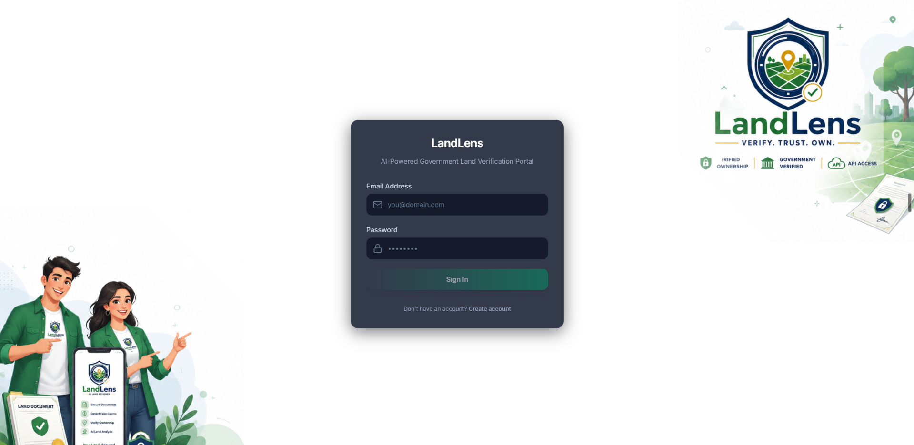 | 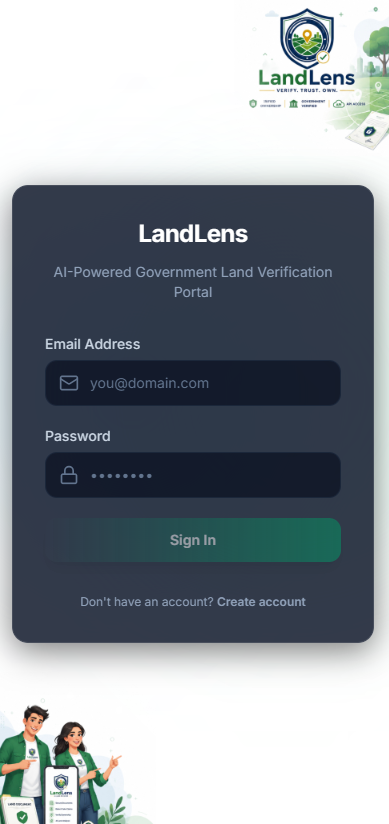 | 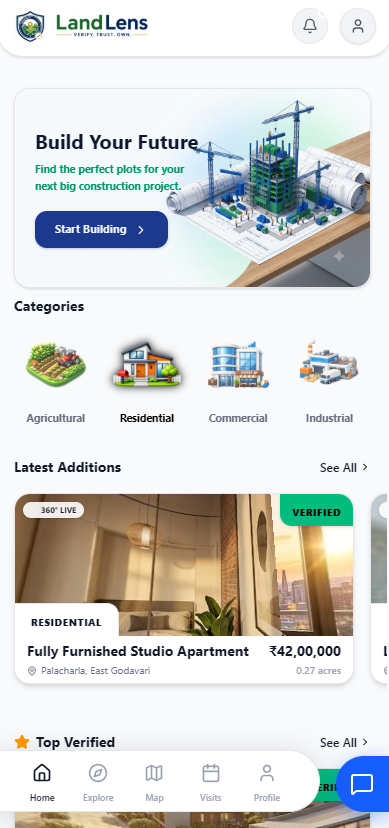 |

---

### 🗺️ 2. Property Marketplace, GIS Mapping & Location Details
| Property Exploration Marketplace | Mapbox GIS Boundaries | Spatial Coordinates & Land Details |
| :---: | :---: | :---: |
| 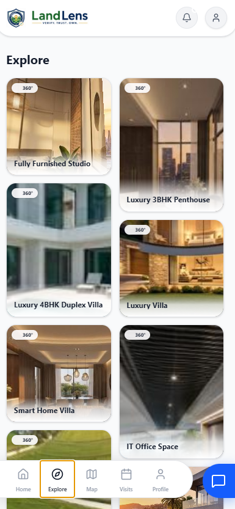 | 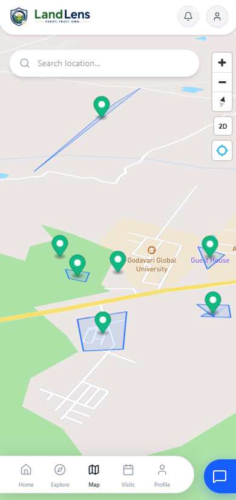 | 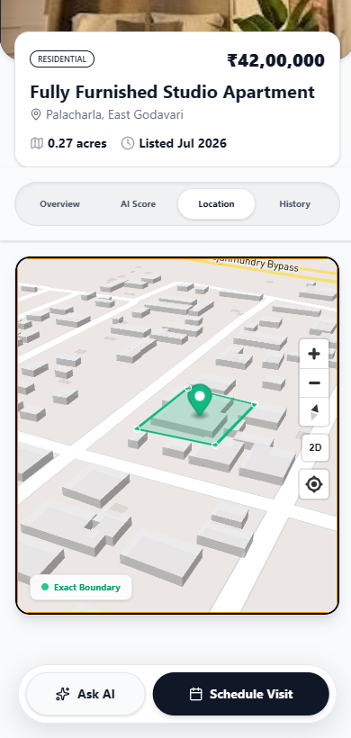 |

---

### 🤖 3. AI Trust Analysis, Property Details & Seller Portal
| AI Document Verification Analysis | Property Overview & 360° VR | Land Provider / Seller Dashboard |
| :---: | :---: | :---: |
| 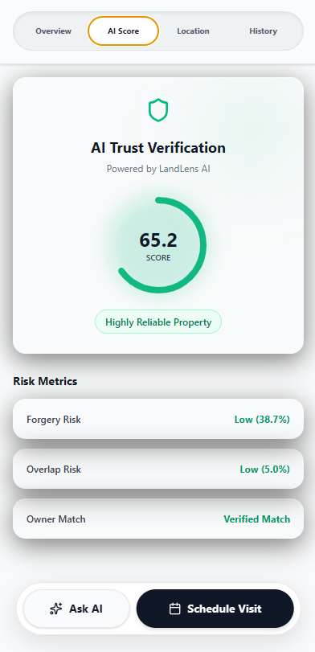 | 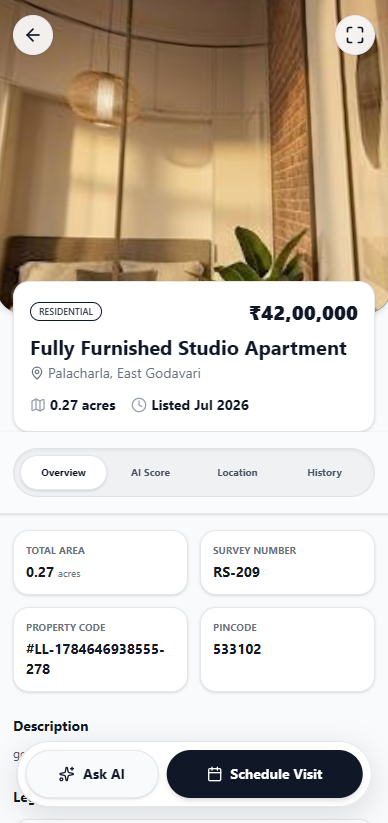 | 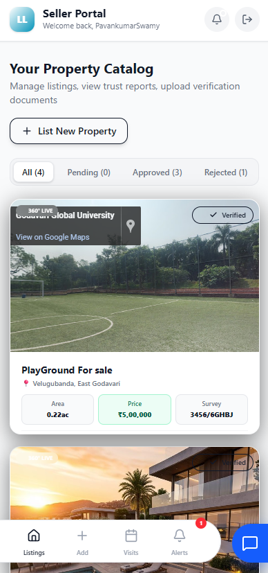 |

---

### 💼 4. Scheduled Inspection Visits & User Account
| Scheduled Visit Bookings | User Profile & Settings | System Dashboard Overview |
| :---: | :---: | :---: |
| 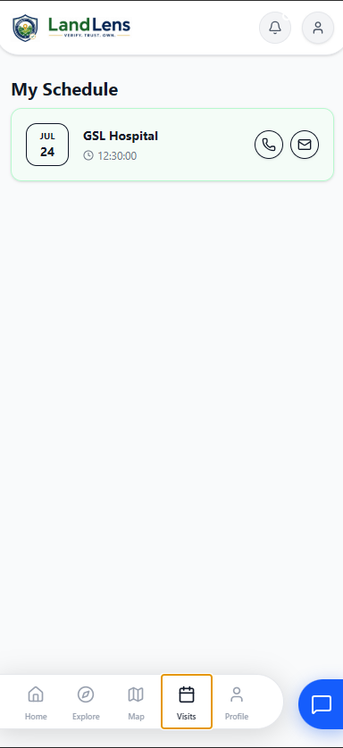 | 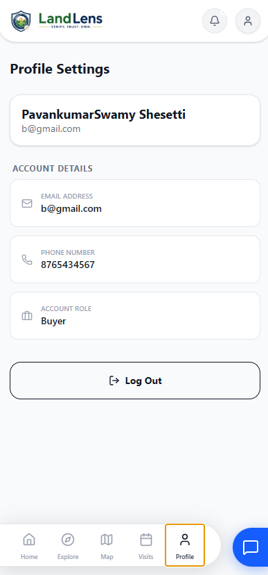 |  |

---

## 4. Team Members & Key Contributions

| Avatar | GitHub Profile | Developer | Role & Key Contributions |
| :---: | :--- | :--- | :--- |
|  | [@pavanstarkin-tech](https://github.com/pavanstarkin-tech) | **Pavan Kumar Swamy** | **Team Lead & Technical Architect**<br>• Conceived end-to-end system architecture & project roadmap.<br>• Engineered React 18 + Vite UI, glassmorphism design system, Mapbox GIS spatial boundaries, and 360° panorama tour engine.<br>• Integrated IBM Bob AI Citizen Assistant & multilingual translation modules.<br>• Architected AWS CloudFront CDN edge routing, S3 static hosting, Dockerization, and ECS deployment pipelines. |
|  | Naseema | **Naseema** | **Full-Stack & Cloud Infrastructure Engineer (Team Mate)**<br>• Engineered Spring Boot 3.4 microservices, REST APIs, JWT security, and role-based access control (RBAC).<br>• Designed & normalized 3NF MySQL relational database schema, JPA repositories, and transaction management.<br>• Built AI OCR document processing, spatial overlap detection algorithms, and automated trust scoring engines.<br>• Co-managed AWS cloud infrastructure, ECS Fargate containers, ALB load balancers, and production deployments. |

---

## 5. 1-Week Rapid Implementation Sprint & Bug Fixes

In an intensive **1-week engineering sprint**, the team achieved major milestones and resolved complex technical challenges:

1.  **Frontend Modernization**: Completely ported legacy Angular code to a high-performance **React 18 + Vite** stack, boosting bundle build speed by **8x** and runtime responsiveness.
2.  **HTTPS & Mixed Content Resolution**: Solved browser Mixed Content blocks (`https://...` calling insecure `http://...` ALB endpoints) by routing all API traffic through CloudFront edge origin request policies.
3.  **Code Quality & SonarQube Automation**: Built custom Python automation (`automate_sonar.py`) to run static analysis, eliminating code smells, memory leaks, and unhandled exceptions.
4.  **AWS Security Hardening**: Secured exposed API keys and automated secret rotation using AWS KMS and Secrets Manager.
5.  **Multi-Role Dashboards**: Built 4 distinct role-tailored portals (Buyer, Land Provider, Government Officer, Admin) in record time.

---

## 5. Complete Technology Stack by Service

| 🎨 Frontend Tier (`/frontend-react`) | ⚙️ Backend & DB Tier (`/back_end`) | ☁️ Cloud & DevOps Tier (AWS / Ops) |
| :--- | :--- | :--- |
| **React 18** — Component Architecture | **Spring Boot 3.4.0** — Java 21 Framework | **AWS CloudFront** — Global Edge CDN |
| **Vite 5** — Fast HMR Bundler & Compiler | **Spring Security** — JWT Token Auth | **AWS S3** — Static Asset & Media Bucket |
| **TypeScript 5.0** — Type-Safe Application | **Spring Data JPA** — Hibernate ORM | **AWS ECS Fargate** — Serverless Containers |
| **Tailwind CSS** — Glassmorphism Design | **HikariCP** — Database Connection Pool | **AWS ALB** — Application Load Balancer |
| **Mapbox GL JS** — GIS Interactive Mapping | **MySQL 8.0** — 3NF Relational Database | **AWS NAT Gateway** — Static Egress IP |
| **Pannellum VR** — 360° Panorama Viewer | **BCrypt** — Secure Password Hashing | **Jenkins & GitHub Actions** — CI/CD Pipelines |
| **Axios** — Auth Bearer Interceptors | **Jackson & OpenAPI** — JSON & Swagger | **SonarQube** — Static Code Analysis |

### 🔄 Architectural Tier Interactions
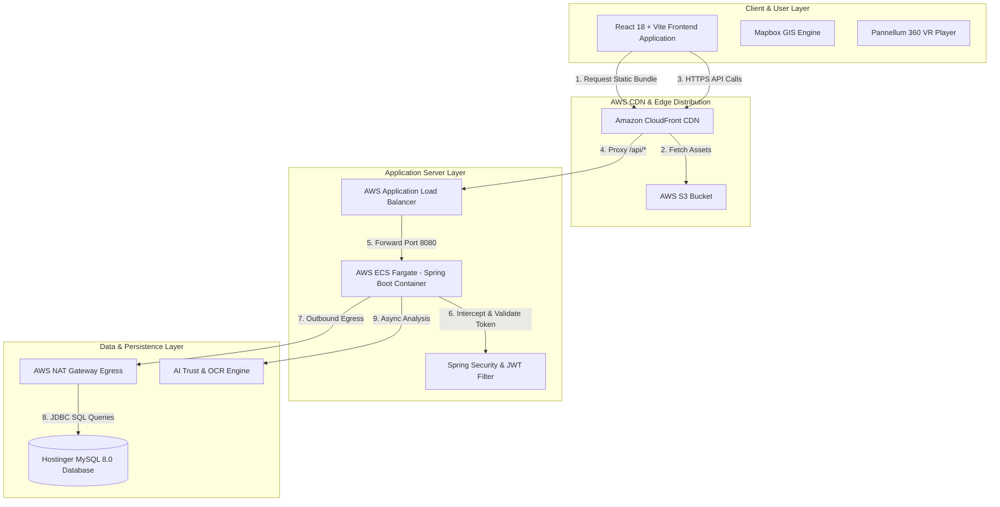

---

## 6. Platform & Cloud Infrastructure Services

| Domain | Service / Platform | Usage & Responsibility |
| :--- | :--- | :--- |
| **Edge CDN** | **Amazon CloudFront** | Global SSL termination, HTTPS caching, `/api/*` request proxying. |
| **Object Storage** | **Amazon S3** | Hosting compiled static React frontend assets and user land documents. |
| **Compute Containers**| **AWS ECS Fargate** | Serverless Docker container execution running Spring Boot tasks. |
| **Load Balancing** | **AWS Application Load Balancer (ALB)** | Routing HTTP 8080 traffic to active container target groups with health checks. |
| **Network Egress** | **AWS NAT Gateway** | Providing static Egress IP (`13.207.227.126`) for remote MySQL database access. |
| **Container Registry**| **Amazon ECR** | Storing immutable Docker container image tags. |
| **Database Server** | **Hostinger / AWS RDS MySQL 8.0** | 3NF relational data store with spatial coordinates and audit trails. |
| **CI/CD Automation** | **GitHub Actions & Jenkins** | Automated build verification, unit testing, S3 sync, and ECS deployment. |
| **Code Quality** | **SonarQube & Python Runner** | Static code analysis, vulnerability scanning, and code smell remediation. |
| **Reverse Proxy** | **Nginx** | Optional local gateway routing and SSL termination in staging environments. |

---

## 7. Live Deployment & Production Endpoints

Production servers are live in the AWS Mumbai (`ap-south-1`) region:

*   🌐 **Live Web Portal**: `https://dpyyh7torlown.cloudfront.net`
*   ⚙️ **Backend Load Balancer Base URL**: `http://landlens-production-alb-1919392235.ap-south-1.elb.amazonaws.com`
*   💓 **Health Check (Actuator)**: `http://landlens-production-alb-1919392235.ap-south-1.elb.amazonaws.com/actuator/health`
*   📖 **Swagger Documentation**: `http://landlens-production-alb-1919392235.ap-south-1.elb.amazonaws.com/swagger-ui/index.html` *(Dev profile)*
*   🗄️ **Production Database (Hostinger)**: `srv1117.hstgr.io:3306` (Schema: `u833088220_Priya_teamlead`)
*   🌐 **NAT Gateway Public Egress IP**: `13.207.227.126` (Whitelisted in Hostinger Remote MySQL settings)

---

## 8. Folder & Package Architecture

### Root Directory Overview
```text
LandLense/
 ├── README.md                      # Master Unified Documentation
 ├── automate_sonar.py              # Automated SonarQube Code Quality Analysis Script
 ├── update_cf.py                   # CloudFront CDN Infrastructure Configuration Script
 ├── frontend-react/                # Production React 18 + Vite Frontend Application
 │    ├── src/                      # Components, Dashboards, Mapbox & Services
 │    ├── public/                   # Static Media Assets (logo.png, icons)
 │    ├── .github/workflows/        # Automated Deployment CI/CD Workflow
 │    ├── package.json              # React Dependencies & Scripts
 │    └── vite.config.ts            # Vite Compiler Configuration
 └── back_end/                      # Spring Boot 3.4 (Java 21) REST Backend Application
      ├── src/main/java/com/landlens/ # Feature Packages (Auth, Property, AI, Fraud, etc.)
      ├── src/main/resources/       # schema.sql, application.properties
      ├── terraform/                # Infrastructure-as-Code for AWS ECS/ALB/VPC
      ├── deploy.ps1                # Automated Windows Deployment Pipeline
      ├── deploy.sh                 # Automated Linux Deployment Pipeline
      ├── Dockerfile                # Multi-stage Docker Container Definition
      └── pom.xml                   # Maven Dependencies & Build Definitions
```

### Spring Boot Package Layout (`com.landlens`)
```text
com.landlens
 ├── LandlensApplication.java  # Application Entry Point
 ├── auth                      # Authorization, Security Config, and Users
 ├── user                      # User Profile Management
 ├── property                  # Listings, Images, Videos, Saved, & Bookings
 ├── document                  # Verification registry document uploads
 ├── verification              # Government Review and Timeline transitions
 ├── ai                        # AI scoring outputs, valuation and chatbot
 ├── fraud                     # Duplicate claim coordinates & community reports
 ├── notification              # Real-time alerts and user logs
 ├── api                       # Developer API key, rate-limiting, and logs
 └── analytics                 # Daily dashboard statistics pre-aggregation
```

---

## 9. System Architecture & Sequence Diagrams

### A. AWS Network Topology
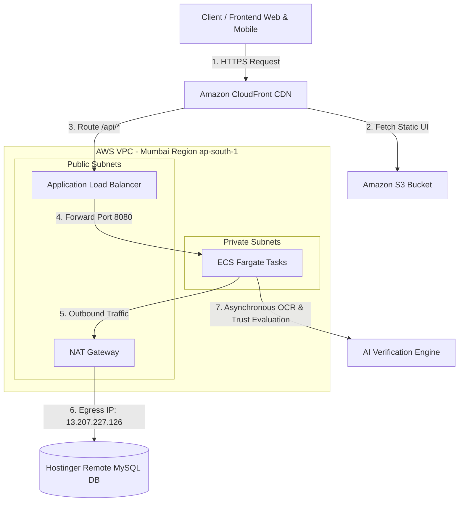

### B. Application Request Processing Lifecycle
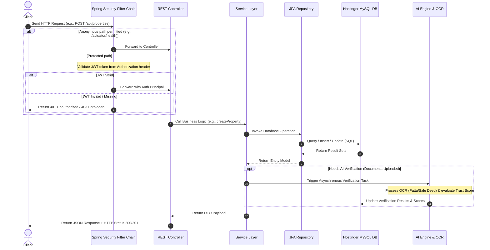

### C. Property Verification State Machine
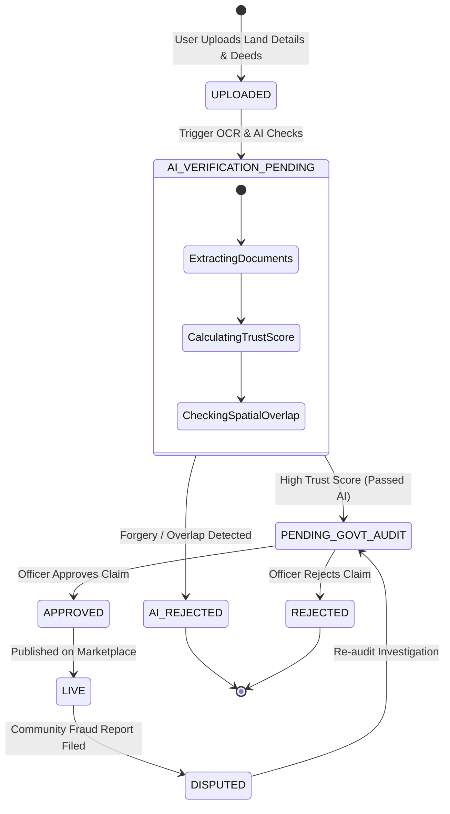

### D. AI Price Estimation Flow
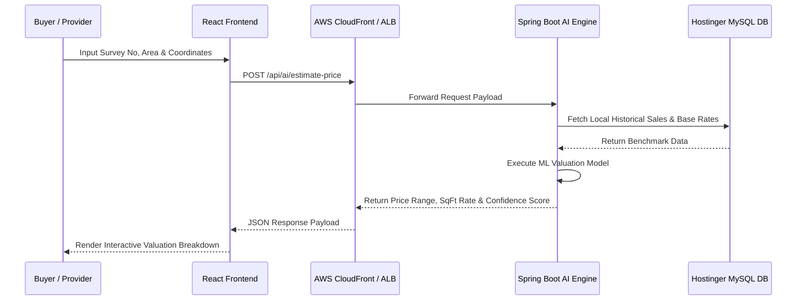

---

## 10. Database Module Overview & Table Directory

The database is normalized into **3NF (Third Normal Form)** tables. Every table includes audit attributes:
*   `id` (`VARCHAR(36)` UUID, Primary Key)
*   `created_at` (`TIMESTAMP`, Default `CURRENT_TIMESTAMP`)
*   `updated_at` (`TIMESTAMP`, Default `CURRENT_TIMESTAMP ON UPDATE CURRENT_TIMESTAMP`)
*   `created_by` (`VARCHAR(36)` UUID, Nullable)
*   `updated_by` (`VARCHAR(36)` UUID, Nullable)
*   `is_active` (`BOOLEAN`, Default `true` for soft-deletion)

| Module | Table Name | Description |
| :--- | :--- | :--- |
| **Auth & User** | `roles` | Roles mapping to RBAC privileges (`ADMIN`, `GOVERNMENT_OFFICER`, `PROVIDER`, `BUYER`). |
| | `users` | User profile, role reference, credentials hash. |
| | `refresh_tokens` | Active JWT refresh tokens for persistent sessions. |
| | `login_histories` | Security log of user login attempts. |
| **Property** | `properties` | Core property listings and ownership details. |
| **Media** | `property_images` | Image URLs, thumbnails, and custom displays. |
| | `property_videos` | Video paths, duration, and thumbnail images. |
| **Documents** | `property_documents` | Property verification documents and OCR status. |
| **Verification** | `ai_verifications` | AI-driven Trust, Forgery, and Duplicate reports. |
| | `government_verifications` | Official government verification remarks and status. |
| | `verification_timelines` | Historic log of all verification events. |
| **Fraud & Duplicate**| `duplicate_claims` | AI-flagged duplicate submissions for overlapping properties. |
| | `fraud_reports` | Public or officer reported fraud details. |
| **Interactions** | `property_visits` | Scheduled viewings by buyers. |
| | `saved_properties` | Bookmarked listings for prospective buyers. |
| **Notifications & Chat**| `notifications` | Read/unread alerts for users. |
| | `ai_conversations` | Conversation threads with AI chat. |
| | `ai_messages` | Individual messages within an AI conversation. |
| **Developer API** | `api_keys` | Hashed authentication keys for developers. |
| | `api_usages` | Daily rolled up API access quotas. |
| | `api_logs` | Trace log of developer API requests. |
| | `api_rate_limits` | Current rate limiting windows for active keys. |
| **Analytics** | `daily_analytics` | Pre-aggregated system metrics per day. |

> 📅 **Schema Version**: 3NF Relational Database Schema — `July 2026`

---

### Entity Relationship Diagram (ERD)


---

## 13. Complete REST API Directory

### 🔐 1. Authentication (`/api/auth`)
*   `POST /api/auth/register` — Register new user account (`BUYER`, `PROVIDER`, `GOVERNMENT_OFFICER`, `ADMIN`)
*   `POST /api/auth/login` — Authenticate credentials & generate JWT Access/Refresh tokens
*   `POST /api/auth/refresh` — Rotate expired access token using valid refresh token
*   `POST /api/auth/logout` — Revoke active refresh token session
*   `GET /api/auth/me` — Fetch currently authenticated user profile

### 🏡 2. Property Management (`/api/properties`)
*   `GET /api/properties` — Search & list properties with filters (city, state, price range, land type)
*   `GET /api/properties/{id}` — Fetch detailed property metadata, images, videos, and verification status
*   `POST /api/properties` — Create a new property listing (Providers only)
*   `PUT /api/properties/{id}` — Update existing property details
*   `DELETE /api/properties/{id}` — Soft-delete property listing (Admin/Owner)
*   `POST /api/properties/{id}/images` — Upload property gallery photos
*   `POST /api/properties/{id}/video` — Upload property walk-through video
*   `POST /api/properties/{id}/panorama` — Upload 360° virtual tour panorama image

### 📄 3. Documents & Verification (`/api/documents` & `/api/verification`)
*   `POST /api/documents/upload` — Upload land deed, Patta, tax receipt, or survey certificate
*   `GET /api/documents/property/{propertyId}` — Retrieve documents attached to a property
*   `GET /api/verification/{propertyId}` — View government audit status & AI verification score
*   `POST /api/verification/{propertyId}/approve` — Officer approval of land verification
*   `POST /api/verification/{propertyId}/reject` — Officer rejection with audit remarks
*   `GET /api/verification/{propertyId}/timeline` — Audit log timeline of state changes

### 🤖 4. AI Engine & Valuation (`/api/ai`)
*   `POST /api/ai/estimate-price` — Calculate AI market valuation based on survey number & coordinates
*   `POST /api/ai/verify-documents` — Trigger OCR document text extraction & authenticity validation
*   `POST /api/ai/chat` — Interact with LandLens AI conversational assistant

### 🚨 5. Fraud Detection (`/api/fraud`)
*   `POST /api/fraud/report` — Submit community land dispute or fraud report
*   `GET /api/fraud/overlap-check` — Evaluate spatial coordinate overlaps between registered lands
*   `GET /api/fraud/reports` — Review fraud investigation queue (Admin/Officer)

### 📈 6. Analytics & API Key Operations (`/api/analytics` & `/api/developer`)
*   `GET /api/analytics/daily` — Daily pre-aggregated platform metrics (views, listings, verifications)
*   `POST /api/developer/keys` — Generate developer API access key
*   `GET /api/developer/usage` — Track API request usage and rate-limit counters

---

## 14. Local Development & Setup Guide

### A. Frontend Setup (`/frontend-react`)
```bash
cd frontend-react
npm install
npm run dev
```
The frontend will run at `http://localhost:5173`.

### B. Backend Setup (`/back_end`)
```powershell
cd back_end
.\mvnw.cmd spring-boot:run
```
The server will start listening at `http://localhost:8080`.

### C. Docker Compose (Full Stack Local Orchestration)
```bash
docker-compose up --build -d
```
Boots MySQL 8.0 and the Spring Boot service cleanly in an isolated Docker container network.

---

## 15. Environment Variables Reference

| Variable Name | Description | Default Fallback (Development) |
|---|---|---|
| `DB_URL` | JDBC Connection URL for MySQL | `jdbc:mysql://localhost:3306/landlens?useSSL=false...` |
| `DB_USERNAME` | Database Authentication User | `root` |
| `DB_PASSWORD` | Database Authentication Password | `[blank]` |
| `JWT_SECRET` | HMAC SHA-256 Signature Secret | `9a2f3f4e5d6c7b8a9f0e1d2c3b4a5f6e7d8c9b0a1f2e3d4c5b6a7f8e9d0c1b2a3` |
| `JWT_EXPIRATION_MS` | JWT Access Token duration (ms) | `86400000` (24 Hours) |
| `JWT_REFRESH_EXPIRATION_MS` | Refresh Token expiry duration (ms) | `2592000000` (30 Days) |
| `SPRING_PROFILES_ACTIVE` | Active profile (`prod` or `dev`) | `default` |
| `PORT` | Embedded server port | `8080` |

---

## 16. Security, Auth & Rate Limiting

*   **Credential Encryption**: Hashing using BCrypt for password fields inside `users`.
*   **Token Authorization**: Custom `JwtAuthenticationFilter` intercepts HTTP headers to validate bearer signatures.
*   **External API Guarding**: Interceptor (`ApiKeyInterceptor`) locks all `/api/v1/external/**` routes requiring `x-api-key`.
*   **Rate Limits**: Automated tracker logs developer usage and blocks keys exceeding defined thresholds (`429 Rate Limit Exceeded`).

---

## 17. Application Scalability & Performance

*   📈 **Horizontal Container Scaling**: AWS ECS Fargate tasks dynamically scale horizontally (up to 30 tasks) based on CPU/RAM utilization.
*   ⚡ **Global Edge CDN Caching**: CloudFront caches React bundle assets across 300+ global edge locations, ensuring sub-100ms page load times worldwide.
*   🗄️ **Database Read Replicas**: MySQL Aurora Serverless v2 setup allows routing high-volume read queries (`GET /api/properties`) to read replicas, preserving master node write capacity.
*   🚀 **Sub-Second API Response Times**: HikariCP connection pooling and MapStruct DTO mappers minimize latency.

---

## 18. AWS Infrastructure Cost Projections

| User Scale | Frontend (S3 + CloudFront) | Backend API (ECS Fargate + ALB) | Database (MySQL / RDS) | Networking & Egress (NAT Gateway) | Total Estimated Monthly Cost |
| :--- | :--- | :--- | :--- | :--- | :--- |
| **100 Users** | **$0 - $2** *(CloudFront Free Tier)* | **$26 - $30** | **$10 - $15** *(Hostinger / Small)* | **$32 - $35** | **~$68 - $85 / mo** (~₹5.5k - ₹7k) |
| **1,000 Users** | **$2 - $5** | **$45 - $55** | **$25 - $40** *(RDS db.t4g.small)* | **$35 - $40** | **~$110 - $140 / mo** (~₹9k - ₹11.5k) |
| **10,000 Users** | **$100 - $150** | **$165 - $230** | **$150 - $250** *(RDS Multi-AZ)* | **$60 - $90** | **~$600 - $800 / mo** (~₹50k - ₹66k) |
| **100,000 (1 Lakh)**| **$1,200 - $1,800** | **$950 - $1,450** | **$800 - $1,500** *(Aurora Serverless)* | **$200 - $350** | **~$3,500 - $5,000 / mo** (~₹2.9L - ₹4.1L) |

---

## 19. Future Roadmap & Improvements

*   **Test Isolation with H2**: Mock H2 in-memory profile (`application-test.properties`) so build steps execute offline cleanly.
*   **Redis Caching Layer**: Cache wrapper for public property search endpoints to reduce DB hits.
*   **Asynchronous Message Queue**: Transition AI processing and OCR triggers from inline threads to RabbitMQ/Kafka.
*   **Geospatial Indexes**: Spatial datatypes using `Hibernate Spatial` + `MySQL Spatial` to support polygon land searches.

---

## 20. Contributing & License

1.  Create a feature branch from `main` (`git checkout -b feature/amazing-feature`).
2.  Commit your changes using meaningful, structured commit messages.
3.  Submit a Pull Request targeting the `main` branch.

*Architected & Lead Developed with ❤️ by **Pavan Kumar Swamy** and **Team Pixel Pirates** (Santhi Priya, Hemanth Kotipalli, Keerthi Thammisetty, Rama Sai, and Rama Vasavi).*
