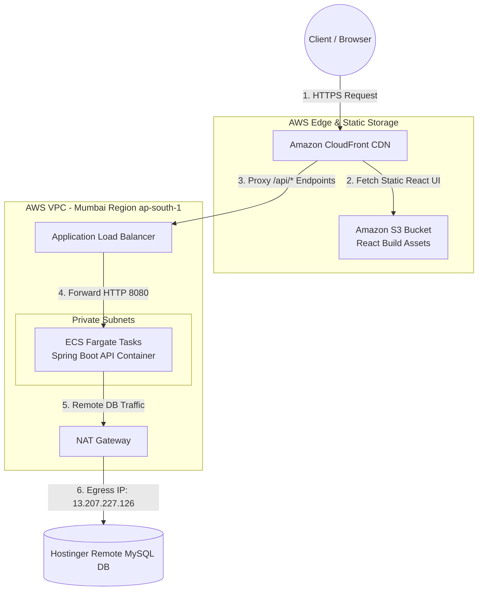
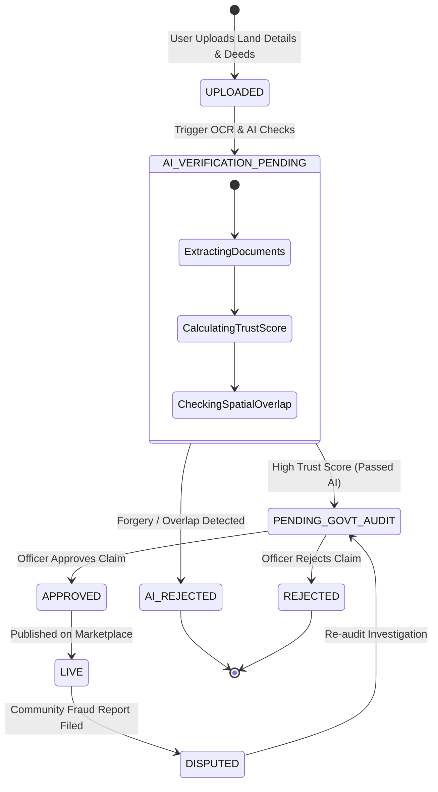
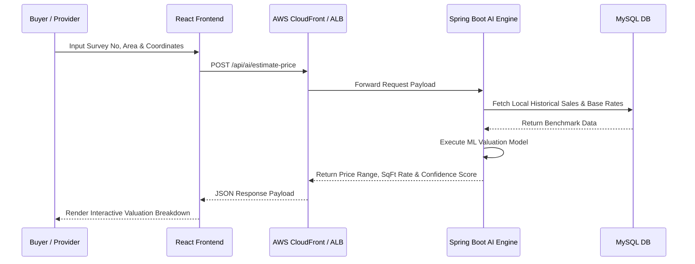

# LandLens 🌍🔍

<p align="center">
  
</p>

<p align="center">
  <a href="https://dpyyh7torlown.cloudfront.net">
    
  </a>
</p>

### 🌐 **Live Deployed Web Portal:** [https://dpyyh7torlown.cloudfront.net](https://dpyyh7torlown.cloudfront.net)

**LandLens** is an end-to-end, AI-powered government land verification and fraud prevention platform. Designed for buyers, land providers, government inspectors, and system administrators, LandLens automates document authenticity verification (OCR), evaluates forgery/overlap risk using AI trust scoring, and offers immersive 360° virtual property tours and interactive GIS map boundaries.

---

## 🏴‍☠️ Meet Team Pixel Pirates & Developers

Behind **LandLens** is the **Pixel Pirates** team—6 talented developers who architected, designed, built, automated, and deployed this modern platform.

| Avatar / Handle | Developer | Role & Contributions |
| :--- | :--- | :--- |
| 👑 **@santhipriyaa27** | **Santhi Priya (Team Lead)** | **Team Lead, DevOps & QA Automation**<br>Lead project manager; architected Jenkins CI/CD automation pipelines, SonarQube code quality auditing (`automate_sonar.py`), bug tracking, test suite execution, and system quality control. |
| 🤖 **@hemanthkotipalli** | **Hemanth Kotipalli** | **AI & GenAI Systems Engineer**<br>Built the interactive AI Chatbot assistant (`landlens-ai-assistant`), OCR document extraction pipeline, GenAI verification algorithms, and automated land trust score calculations. |
| 🗄️ **@keerthithammisetty** | **Keerthi Thammisetty** | **Database Architect & Schema Designer**<br>Designed and normalized the 3NF relational database schema (`schema.sql`), optimized complex JPA query relationships, entity mappings, and database transaction boundaries. |
| 🎨 **@Pavankumarswamy** | **Pavan Kumar Swamy** | **Frontend UI/UX Designer & Lead Engineer**<br>Designed and implemented the glassmorphic React 18 UI, role-based dashboards (Buyer, Provider, Officer, Admin), Mapbox GL JS map engine, and 360° virtual tour viewer. |
| 🚀 **@ramasai98** | **Rama Sai** | **DevOps & Cloud Infrastructure Architect**<br>Architected the AWS Cloud topology—configuring CloudFront CDN edge distribution, S3 static hosting, ECS Fargate container clusters, ALB load balancers, and Terraform IaC scripts. |
| ⚙️ **@vasavi985** | **Rama Vasavi Patchikolla** | **Backend Lead Developer**<br>Developed the core Spring Boot 3.4 (Java 21) REST API services, Spring Security JWT authentication framework, role-based authorization filters, property listing modules, and analytics aggregators. |

---

## 🛠️ Complete Technology Stack

### **Frontend (`/frontend-react`)**
- **Framework & Build**: React 18, Vite, TypeScript
- **Styling & UI**: Tailwind CSS, Glassmorphism design system, Lucide React icons
- **Mapping & GIS**: Mapbox GL JS (Custom boundary drawing, clustering, layers)
- **Virtual Tours**: Pannellum 360° interactive panorama viewer
- **HTTP Client**: Axios with automated JWT Bearer interceptors & error handlers

### **Backend (`/back_end`)**
- **Core Framework**: Spring Boot 3.4.0 (Java 21)
- **Security**: Spring Security, JWT (Stateless authentication with token rotation), BCrypt
- **ORM & Data**: Spring Data JPA, Hibernate, HikariCP connection pool
- **Database**: MySQL 8.0 (3NF Normalized schema)
- **API Specs**: Springdoc OpenAPI 3.0 / Swagger UI

### **DevOps, Quality & Cloud Infrastructure**
- **Frontend Hosting**: AWS S3 Bucket + Amazon CloudFront CDN (Global Edge Delivery)
- **Backend Hosting**: AWS ECS Fargate Tasks behind AWS Application Load Balancer (ALB)
- **Network Egress**: AWS NAT Gateway (Elastic IP binding)
- **Code Quality**: SonarQube Static Analysis & Automated Python Sonar Runner (`automate_sonar.py`)
- **CI/CD & Automation**: GitHub Actions, Jenkins, PowerShell/Bash Cloud Deployment Scripts (`deploy.ps1`)

---

## 📡 Complete REST API Directory

Below is the complete catalog of backend endpoints exposed by the Spring Boot server:

### 🔐 1. Authentication (`/api/auth`)
- `POST /api/auth/register` — Register new user account (`BUYER`, `PROVIDER`, `GOVERNMENT_OFFICER`, `ADMIN`)
- `POST /api/auth/login` — Authenticate credentials & generate JWT Access/Refresh tokens
- `POST /api/auth/refresh` — Rotate expired access token using valid refresh token
- `POST /api/auth/logout` — Revoke active refresh token session
- `GET /api/auth/me` — Fetch currently authenticated user profile

### 🏡 2. Property Management (`/api/properties`)
- `GET /api/properties` — Search & list properties with filters (city, state, price range, land type)
- `GET /api/properties/{id}` — Fetch detailed property metadata, images, videos, and verification status
- `POST /api/properties` — Create a new property listing (Providers only)
- `PUT /api/properties/{id}` — Update existing property details
- `DELETE /api/properties/{id}` — Soft-delete property listing (Admin/Owner)
- `POST /api/properties/{id}/images` — Upload property gallery photos
- `POST /api/properties/{id}/video` — Upload property walk-through video
- `POST /api/properties/{id}/panorama` — Upload 360° virtual tour panorama image

### 📄 3. Documents & Verification (`/api/documents` & `/api/verification`)
- `POST /api/documents/upload` — Upload land deed, Patta, tax receipt, or survey certificate
- `GET /api/documents/property/{propertyId}` — Retrieve documents attached to a property
- `GET /api/verification/{propertyId}` — View government audit status & AI verification score
- `POST /api/verification/{propertyId}/approve` — Officer approval of land verification
- `POST /api/verification/{propertyId}/reject` — Officer rejection with audit remarks
- `GET /api/verification/{propertyId}/timeline` — Audit log timeline of state changes

### 🤖 4. AI Engine & Valuation (`/api/ai`)
- `POST /api/ai/estimate-price` — Calculate AI market valuation based on survey number & coordinates
- `POST /api/ai/verify-documents` — Trigger OCR document text extraction & authenticity validation
- `POST /api/ai/chat` — Interact with LandLens AI conversational assistant

### 🚨 5. Fraud Detection (`/api/fraud`)
- `POST /api/fraud/report` — Submit community land dispute or fraud report
- `GET /api/fraud/overlap-check` — Evaluate spatial coordinate overlaps between registered lands
- `GET /api/fraud/reports` — Review fraud investigation queue (Admin/Officer)

### 📈 6. Analytics & API Key Operations (`/api/analytics` & `/api/developer`)
- `GET /api/analytics/daily` — Daily pre-aggregated platform metrics (views, listings, verifications)
- `POST /api/developer/keys` — Generate developer API access key
- `GET /api/developer/usage` — Track API request usage and rate-limit counters

---

## ☁️ AWS Architecture & System Flow Diagrams

### 🏗️ 1. Infrastructure Topology


### 🔄 2. Property Verification Lifecycle State Machine


### 💡 3. AI Price Estimation Flow


---

## 📊 AWS Infrastructure & Usage Cost Projections

Estimated monthly AWS cloud hosting and maintenance costs scaled across active user tiers:

| User Scale | Frontend (S3 + CloudFront) | Backend API (ECS Fargate + ALB) | Database (MySQL / RDS) | Networking & Egress (NAT Gateway) | Total Estimated Monthly Cost |
| :--- | :--- | :--- | :--- | :--- | :--- |
| **100 Users** | **$0 - $2** *(CloudFront Free Tier)* | **$26 - $30** | **$10 - $15** *(Hostinger / Small)* | **$32 - $35** | **~$68 - $85 / mo** (~₹5.5k - ₹7k) |
| **1,000 Users** | **$2 - $5** | **$45 - $55** | **$25 - $40** *(RDS db.t4g.small)* | **$35 - $40** | **~$110 - $140 / mo** (~₹9k - ₹11.5k) |
| **10,000 Users** | **$100 - $150** | **$165 - $230** | **$150 - $250** *(RDS Multi-AZ)* | **$60 - $90** | **~$600 - $800 / mo** (~₹50k - ₹66k) |
| **100,000 (1 Lakh)**| **$1,200 - $1,800** | **$950 - $1,450** | **$800 - $1,500** *(Aurora Serverless)* | **$200 - $350** | **~$3,500 - $5,000 / mo** (~₹2.9L - ₹4.1L) |

---

## 📁 Repository Directory Structure

```text
LandLense/
 ├── README.md                      # Master Project & Team Documentation
 ├── automate_sonar.py              # Automated SonarQube Code Quality Analysis Script
 ├── update_cf.py                   # CloudFront CDN Infrastructure Configuration Script
 ├── frontend-react/                # Production React 18 + Vite Frontend Application
 │    ├── src/                      # Components, Dashboards, Mapbox & Services
 │    ├── public/                   # Static Media Assets (logo.png, icons)
 │    ├── .github/workflows/        # Automated Deployment CI/CD Workflow
 │    ├── package.json              # React Dependencies & Scripts
 │    └── vite.config.ts            # Vite Compiler Configuration
 ├── back_end/                      # Spring Boot 3.4 (Java 21) REST Backend Application
 │    ├── src/main/java/com/landlens/ # Feature Packages (Auth, Property, AI, Fraud, etc.)
 │    ├── src/main/resources/       # schema.sql, application.properties
 │    ├── terraform/                # Infrastructure-as-Code for AWS ECS/ALB/VPC
 │    ├── deploy.ps1                # Automated Windows Deployment Pipeline
 │    ├── deploy.sh                 # Automated Linux Deployment Pipeline
 │    ├── Dockerfile                # Multi-stage Docker Container Definition
 │    └── pom.xml                   # Maven Dependencies & Build Definitions
 └── landlens-ai-assistant/         # AI Chatbot & GenAI Service Engine
```

---
*Developed with ❤️ by **Team Pixel Pirates** (Santhi Priya, Hemanth Kotipalli, Keerthi Thammisetty, Pavan Kumar Swamy, Rama Sai, and Rama Vasavi).*
