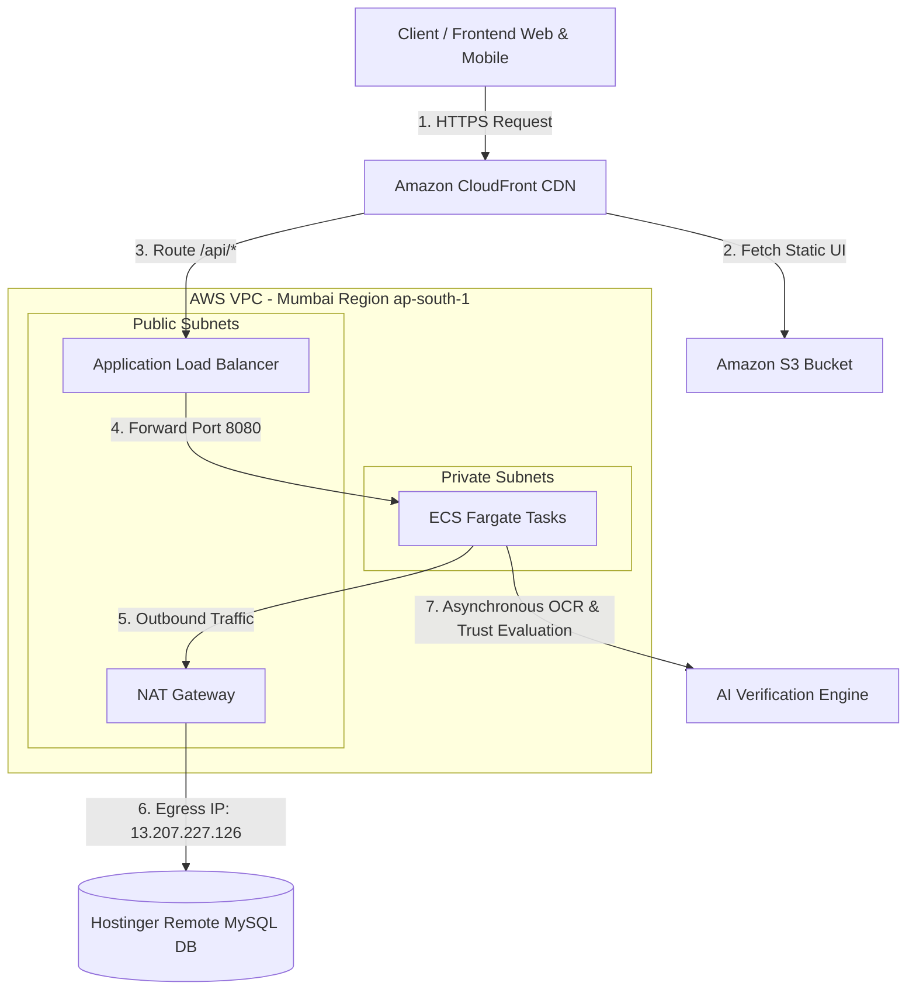
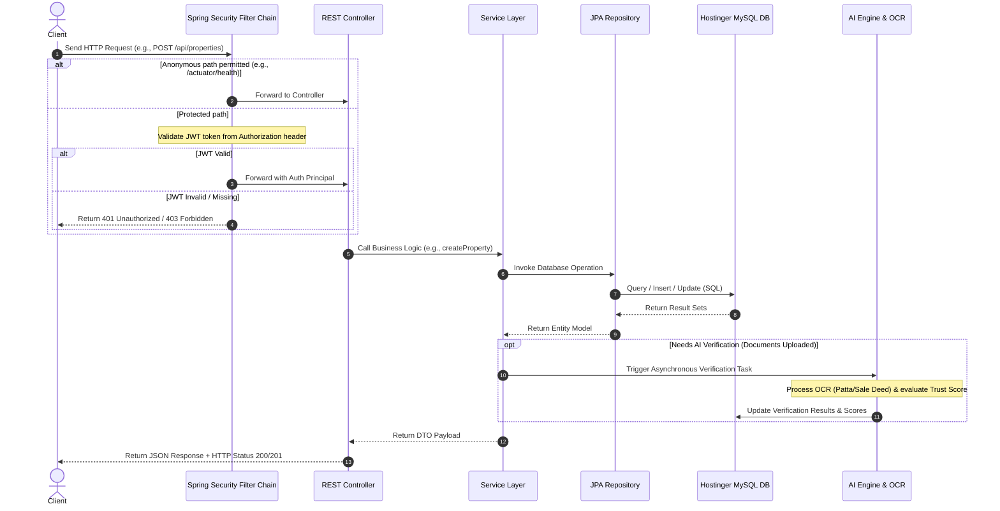
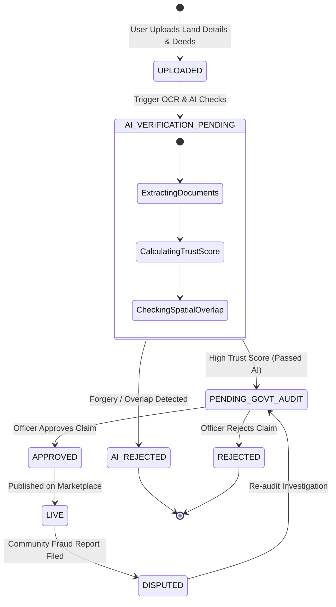
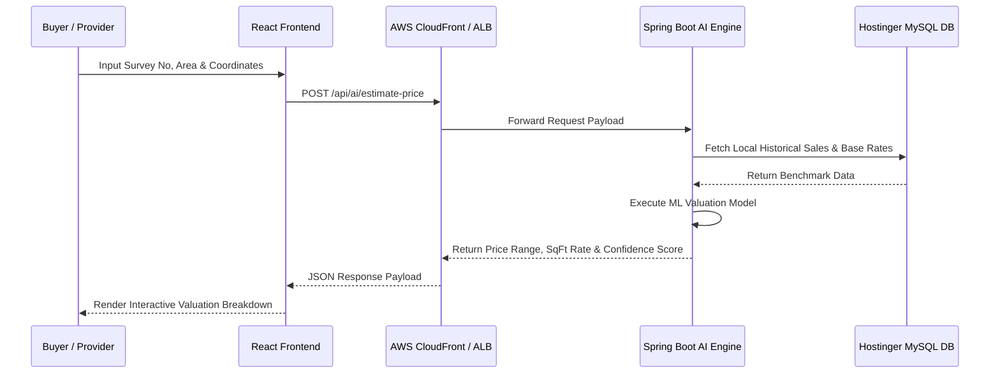
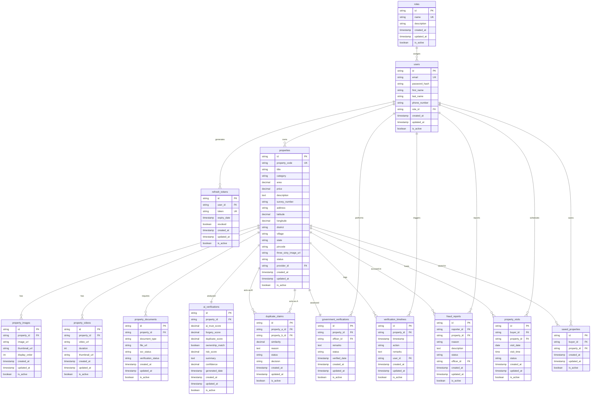

# LandLens 🌍🔍

[](https://adoptium.net/)
[](https://spring.io/projects/spring-boot)
[](https://react.dev/)
[](https://www.typescriptlang.org/)
[](https://www.docker.com/)
[](https://aws.amazon.com/)
[](https://www.mysql.com/)

<p align="center">
  
</p>

<p align="center">
  <a href="https://dpyyh7torlown.cloudfront.net">
    
  </a>
</p>

### 🌐 **Live Deployed Web Portal:** [https://dpyyh7torlown.cloudfront.net](https://dpyyh7torlown.cloudfront.net)

---

## 📑 Table of Contents
1. [Project Description](#1-project-description)
2. [Meet Team Pixel Pirates](#2-meet-team-pixel-pirates)
3. [Key Features](#3-key-features)
4. [Technology Stack](#4-technology-stack)
5. [Live Deployment & Infrastructure Endpoints](#5-live-deployment--infrastructure-endpoints)
6. [Folder & Package Structure](#6-folder--package-structure)
7. [System Architecture & Sequence Diagrams](#7-system-architecture--sequence-diagrams)
8. [Database Module Overview & Table Directory](#8-database-module-overview--table-directory)
9. [Detailed Table Schemas & Column Specifications](#9-detailed-table-schemas--column-specifications)
10. [Full Entity Relationship Diagram (ERD)](#10-full-entity-relationship-diagram-erd)
11. [Complete REST API Directory](#11-complete-rest-api-directory)
12. [Local Development & Setup Guide](#12-local-development--setup-guide)
13. [Environment Variables Reference](#13-environment-variables-reference)
14. [Build & Testing Instructions](#14-build--testing-instructions)
15. [Security, Auth & Rate Limiting](#15-security-auth--rate-limiting)
16. [Multi-Cloud Deployment Options](#16-multi-cloud-deployment-options)
17. [AWS Infrastructure Cost Projections](#17-aws-infrastructure-cost-projections)
18. [Future Roadmap & Improvements](#18-future-roadmap--improvements)
19. [Contributing & License](#19-contributing--license)

---

## 1. Project Description

**LandLens** is a secure, high-performance web platform designed to digitize, verify, and automate land registry processes to prevent real estate fraud, overlap claims, and document forgery. 

By integrating Optical Character Recognition (OCR), AI-driven duplicate claims detection, 360° interactive virtual property tours, and a multi-level review workflow (including government inspectors), LandLens provides a single source of truth for land asset listings.

---

## 2. Meet Team Pixel Pirates

Behind **LandLens** is the **Pixel Pirates** team—6 dedicated engineers who architected, designed, built, automated, and deployed this platform:

| Avatar | GitHub Profile | Role & Contributions |
| :---: | :--- | :--- |
|  | [@santhipriyaa27](https://github.com/santhipriyaa27)<br>*(Santhi Priya)* | **Team Lead, DevOps & QA Automation**<br>Lead project manager; architected Jenkins CI/CD automation pipelines, SonarQube code quality auditing (`automate_sonar.py`), bug tracking, test execution, and quality control. |
|  | [@hemanthkotipalli](https://github.com/hemanthkotipalli)<br>*(Hemanth Kotipalli)* | **AI & GenAI Systems Engineer**<br>Built the interactive AI Chatbot assistant, OCR document extraction pipeline, GenAI verification algorithms, and automated land trust score calculations. |
|  | [@keerthithammisetty](https://github.com/keerthithammisetty)<br>*(Keerthi Thammisetty)* | **Database Architect & Schema Designer**<br>Engineered and normalized the 3NF relational database schema (`schema.sql`), optimized JPA query relationships, entity mappings, and database transaction boundaries. |
|  | [@Pavankumarswamy](https://github.com/Pavankumarswamy)<br>*(Pavan Kumar Swamy)* | **Frontend UI/UX Designer & Lead Engineer**<br>Designed and implemented the glassmorphic React 18 UI, role-based dashboards (Buyer, Provider, Officer, Admin), Mapbox GL JS map engine, and 360° virtual tour player. |
|  | [@ramasai98](https://github.com/ramasai98)<br>*(Rama Sai)* | **DevOps & Cloud Infrastructure Architect**<br>Architected the AWS Cloud topology—configuring CloudFront CDN edge distribution, S3 static hosting, ECS Fargate container clusters, ALB load balancers, and Terraform IaC scripts. |
|  | [@vasavi985](https://github.com/vasavi985)<br>*(Rama Vasavi Patchikolla)* | **Backend Lead Developer**<br>Engineered the core Spring Boot 3.4 (Java 21) REST API services, Spring Security JWT authentication framework, role-based authorization filters, and analytics aggregators. |

---

## 3. Key Features

*   **Role-Based Access Control (RBAC)**: Managed user roles (`ADMIN`, `GOVERNMENT_OFFICER`, `PROVIDER`, `BUYER`) using stateless JWT sessions (with access and refresh token rotation) and BCrypt password encryption.
*   **Property Listing & Asset Management**: Cataloging of agricultural, commercial, industrial, and residential properties with coordinate tracking (latitude/longitude), address resolution, and pricing structures.
*   **Property Media & Virtual Tours**: Standard images, video walkthrough tours, and interactive 360-degree panorama viewer uploads.
*   **Verification Documents & OCR**: Registry document uploads (Patta, Sale Deeds, Tax Receipts) supporting OCR queues and verification statuses.
*   **AI Verification Engine & Valuations**: Asynchronous trust scoring, forgery evaluation, duplicate listing detection, coordinate overlap calculations, AI price estimations, and automated AI chat queries.
*   **Government Review Workflow**: Inspection audit trails, timeline transitions (`UPLOADED`, `AI_STARTED`, `APPROVED`, `REJECTED`), and officer remark logs.
*   **Buyer Interactions**: Property watchlists (saved items) and tour visit scheduling (date/time/status).
*   **Developer API Integration**: Dynamic API key generation, request logging (endpoint, status code, latency, IP), and rate limiting.
*   **Analytics Aggregator**: Daily analytics pre-aggregation scheduler summarizing views, searches, verifications, frauds, and API usage statistics for dashboard reporting.

---

## 4. Technology Stack

### **Frontend (`/frontend-react`)**
*   **Framework & Build**: React 18, Vite, TypeScript
*   **Styling & UI**: Tailwind CSS (PostCSS), Glassmorphism design system, Lucide React icons
*   **Mapping & GIS**: Mapbox GL JS (Custom boundary drawing, clustering, survey overlays)
*   **Virtual Tours**: Pannellum 360° interactive panorama viewer
*   **HTTP Client**: Axios with automated JWT Bearer interceptors & error handlers

### **Backend (`/back_end`)**
*   **Core Framework**: Spring Boot 3.4.0 (Java 21)
*   **Security & Auth**: Spring Security, JWT (JJWT 0.12.5), BCrypt
*   **Database & ORM**: Hibernate (JPA), MySQL Connector J, HikariCP Connection Pool
*   **API Specs**: Springdoc OpenAPI / Swagger UI (v2.8.9)
*   **Health & Metrics**: Spring Boot Actuator

### **DevOps, Quality & Cloud Infrastructure**
*   **Frontend Hosting**: AWS S3 Bucket + Amazon CloudFront CDN (Global Edge Delivery)
*   **Backend Hosting**: AWS ECS Fargate Tasks behind AWS Application Load Balancer (ALB)
*   **Network Egress**: AWS NAT Gateway (`13.207.227.126` Egress IP)
*   **Code Quality**: SonarQube Static Analysis & Automated Python Sonar Runner (`automate_sonar.py`)
*   **CI/CD & Automation**: GitHub Actions, Jenkins, PowerShell/Bash Cloud Deployment Pipelines (`deploy.ps1`)

---

## 5. Live Deployment & Infrastructure Endpoints

Production servers are live in the AWS Mumbai (`ap-south-1`) region:

*   **Live Web Portal**: `https://dpyyh7torlown.cloudfront.net`
*   **Backend Load Balancer Base URL**: `http://landlens-production-alb-1919392235.ap-south-1.elb.amazonaws.com`
*   **Health Check (Actuator)**: `http://landlens-production-alb-1919392235.ap-south-1.elb.amazonaws.com/actuator/health`
*   **Swagger Documentation**: `http://landlens-production-alb-1919392235.ap-south-1.elb.amazonaws.com/swagger-ui/index.html` *(Dev profile)*
*   **Production Database (Hostinger)**: `srv1117.hstgr.io:3306` (Schema: `u833088220_Priya_teamlead`)
*   **NAT Gateway Public Egress IP**: `13.207.227.126` (Whitelisted in Hostinger Remote MySQL settings)

---

## 6. Folder & Package Structure

### Root Directory Overview
```text
LandLense/
 ├── README.md                      # Master Project & Team Documentation
 ├── automate_sonar.py              # Automated SonarQube Code Quality Analysis Script
 ├── update_cf.py                   # CloudFront CDN Infrastructure Configuration Script
 ├── frontend-react/                # Production React 18 + Vite Frontend Application
 │    ├── src/                      # Components, Dashboards, Mapbox & Services
 │    ├── public/                   # Static Media Assets (logo.png, icons)
 │    ├── .github/workflows/        # Automated Deployment CI/CD Workflow
 │    ├── package.json              # React Dependencies & Scripts
 │    └── vite.config.ts            # Vite Compiler Configuration
 └── back_end/                      # Spring Boot 3.4 (Java 21) REST Backend Application
      ├── src/main/java/com/landlens/ # Feature Packages (Auth, Property, AI, Fraud, etc.)
      ├── src/main/resources/       # schema.sql, application.properties
      ├── terraform/                # Infrastructure-as-Code for AWS ECS/ALB/VPC
      ├── deploy.ps1                # Automated Windows Deployment Pipeline
      ├── deploy.sh                 # Automated Linux Deployment Pipeline
      ├── Dockerfile                # Multi-stage Docker Container Definition
      └── pom.xml                   # Maven Dependencies & Build Definitions
```

### Spring Boot Package Layout (`com.landlens`)
```text
com.landlens
 ├── LandlensApplication.java  # Application Entry Point
 ├── auth                      # Authorization, Security Config, and Users
 ├── user                      # User Profile Management
 ├── property                  # Listings, Images, Videos, Saved, & Bookings
 ├── document                  # Verification registry document uploads
 ├── verification              # Government Review and Timeline transitions
 ├── ai                        # AI scoring outputs, valuation and chatbot
 ├── fraud                     # Duplicate claim coordinates & community reports
 ├── notification              # Real-time alerts and user logs
 ├── api                       # Developer API key, rate-limiting, and logs
 └── analytics                 # Daily dashboard statistics pre-aggregation
```

---

## 7. System Architecture & Sequence Diagrams

### A. AWS Network Topology


### B. Application Request Processing Lifecycle


### C. Property Verification State Machine


### D. AI Price Estimation Flow


---

## 8. Database Module Overview & Table Directory

The database is normalized into **3NF (Third Normal Form)** tables. Every table includes audit attributes:
*   `id` (`VARCHAR(36)` UUID, Primary Key)
*   `created_at` (`TIMESTAMP`, Default `CURRENT_TIMESTAMP`)
*   `updated_at` (`TIMESTAMP`, Default `CURRENT_TIMESTAMP ON UPDATE CURRENT_TIMESTAMP`)
*   `created_by` (`VARCHAR(36)` UUID, Nullable)
*   `updated_by` (`VARCHAR(36)` UUID, Nullable)
*   `is_active` (`BOOLEAN`, Default `true` for soft-deletion)

| Module | Table Name | Description |
| :--- | :--- | :--- |
| **Auth & User** | `roles` | Roles mapping to RBAC privileges (`ADMIN`, `GOVERNMENT_OFFICER`, `PROVIDER`, `BUYER`). |
| | `users` | User profile, role reference, credentials hash. |
| | `refresh_tokens` | Active JWT refresh tokens for persistent sessions. |
| | `login_histories` | Security log of user login attempts. |
| **Property** | `properties` | Core property listings and ownership details. |
| **Media** | `property_images` | Image URLs, thumbnails, and custom displays. |
| | `property_videos` | Video paths, duration, and thumbnail images. |
| **Documents** | `property_documents` | Property verification documents and OCR status. |
| **Verification** | `ai_verifications` | AI-driven Trust, Forgery, and Duplicate reports. |
| | `government_verifications` | Official government verification remarks and status. |
| | `verification_timelines` | Historic log of all verification events. |
| **Fraud & Duplicate**| `duplicate_claims` | AI-flagged duplicate submissions for overlapping properties. |
| | `fraud_reports` | Public or officer reported fraud details. |
| **Interactions** | `property_visits` | Scheduled viewings by buyers. |
| | `saved_properties` | Bookmarked listings for prospective buyers. |
| **Notifications & Chat**| `notifications` | Read/unread alerts for users. |
| | `ai_conversations` | Conversation threads with AI chat. |
| | `ai_messages` | Individual messages within an AI conversation. |
| **Developer API** | `api_keys` | Hashed authentication keys for developers. |
| | `api_usages` | Daily rolled up API access quotas. |
| | `api_logs` | Trace log of developer API requests. |
| | `api_rate_limits` | Current rate limiting windows for active keys. |
| **Analytics** | `daily_analytics` | Pre-aggregated system metrics per day. |

---

## 9. Detailed Table Schemas & Column Specifications

### Authentication & User Module

#### `roles`
*   `id` (`VARCHAR(36)`, PK)
*   `name` (`VARCHAR(50)`, Not Null, Unique) - Values: `ADMIN`, `GOVERNMENT_OFFICER`, `PROVIDER`, `BUYER`
*   `description` (`VARCHAR(255)`)
*   *Standard Audit Columns* (`created_at`, `updated_at`, `created_by`, `updated_by`, `is_active`)

#### `users`
*   `id` (`VARCHAR(36)`, PK)
*   `email` (`VARCHAR(150)`, Not Null, Unique)
*   `password_hash` (`VARCHAR(255)`, Not Null)
*   `first_name` (`VARCHAR(100)`, Not Null)
*   `last_name` (`VARCHAR(100)`, Not Null)
*   `phone_number` (`VARCHAR(20)`)
*   `role_id` (`VARCHAR(36)`, Not Null, FK referencing `roles(id)`)
*   *Standard Audit Columns*

#### `refresh_tokens`
*   `id` (`VARCHAR(36)`, PK)
*   `user_id` (`VARCHAR(36)`, Not Null, FK referencing `users(id)`)
*   `token` (`VARCHAR(512)`, Not Null, Unique)
*   `expiry_date` (`TIMESTAMP`, Not Null)
*   `revoked` (`BOOLEAN`, Not Null, Default `false`)
*   *Standard Audit Columns*

#### `login_histories`
*   `id` (`VARCHAR(36)`, PK)
*   `user_id` (`VARCHAR(36)`, Not Null, FK referencing `users(id)`)
*   `login_timestamp` (`TIMESTAMP`, Not Null, Default `CURRENT_TIMESTAMP`)
*   `ip_address` (`VARCHAR(45)`, Not Null)
*   `user_agent` (`VARCHAR(512)`)
*   `status` (`VARCHAR(20)`, Not Null) - Values: `SUCCESS`, `FAILED`
*   *Standard Audit Columns*

---

### Property Module

#### `properties`
*   `id` (`VARCHAR(36)`, PK)
*   `property_code` (`VARCHAR(50)`, Not Null, Unique)
*   `title` (`VARCHAR(150)`, Not Null)
*   `category` (`VARCHAR(50)`, Not Null) - Values: `RESIDENTIAL`, `COMMERCIAL`, `AGRICULTURAL`, `INDUSTRIAL`
*   `area` (`DECIMAL(12,2)`, Not Null)
*   `price` (`DECIMAL(15,2)`, Not Null)
*   `description` (`TEXT`)
*   `survey_number` (`VARCHAR(50)`, Not Null)
*   `address` (`VARCHAR(255)`, Not Null)
*   `latitude` (`DECIMAL(9,6)`, Not Null)
*   `longitude` (`DECIMAL(9,6)`, Not Null)
*   `district` (`VARCHAR(100)`, Not Null)
*   `village` (`VARCHAR(100)`, Not Null)
*   `state` (`VARCHAR(100)`, Not Null)
*   `pincode` (`VARCHAR(10)`, Not Null)
*   `three_sixty_image_url` (`VARCHAR(512)`)
*   `status` (`VARCHAR(30)`, Not Null) - Values: `PENDING_AI`, `PENDING_GOVT`, `APPROVED`, `REJECTED`, `DISPUTED`
*   `provider_id` (`VARCHAR(36)`, Not Null, FK referencing `users(id)`)
*   *Standard Audit Columns*

#### `property_images`
*   `id` (`VARCHAR(36)`, PK)
*   `property_id` (`VARCHAR(36)`, Not Null, FK referencing `properties(id)`)
*   `image_url` (`VARCHAR(512)`, Not Null)
*   `thumbnail_url` (`VARCHAR(512)`, Not Null)
*   `display_order` (`INT`, Not Null, Default `0`)
*   *Standard Audit Columns*

#### `property_videos`
*   `id` (`VARCHAR(36)`, PK)
*   `property_id` (`VARCHAR(36)`, Not Null, FK referencing `properties(id)`)
*   `video_url` (`VARCHAR(512)`, Not Null)
*   `duration` (`INT`) - Duration in seconds
*   `thumbnail_url` (`VARCHAR(512)`)
*   *Standard Audit Columns*

#### `property_documents`
*   `id` (`VARCHAR(36)`, PK)
*   `property_id` (`VARCHAR(36)`, Not Null, FK referencing `properties(id)`)
*   `document_type` (`VARCHAR(50)`, Not Null) - Values: `SALE_DEED`, `PATTA`, `SURVEY_MAP`, `TAX_RECEIPT`, `IDENTITY_PROOF`, `OWNERSHIP_PROOF`
*   `file_url` (`VARCHAR(512)`, Not Null)
*   `ocr_status` (`VARCHAR(30)`, Not Null) - Values: `PENDING`, `PROCESSING`, `COMPLETED`, `FAILED`
*   `verification_status` (`VARCHAR(30)`, Not Null) - Values: `UNVERIFIED`, `VERIFIED`, `REJECTED`
*   *Standard Audit Columns*

---

### Verification Module

#### `ai_verifications`
*   `id` (`VARCHAR(36)`, PK)
*   `property_id` (`VARCHAR(36)`, Not Null, Unique, FK referencing `properties(id)`)
*   `ai_trust_score` (`DECIMAL(5,2)`, Not Null) - Scale `0.00` to `100.00`
*   `forgery_score` (`DECIMAL(5,2)`, Not Null)
*   `duplicate_score` (`DECIMAL(5,2)`, Not Null)
*   `ownership_match` (`BOOLEAN`, Not Null)
*   `risk_score` (`DECIMAL(5,2)`, Not Null)
*   `summary` (`TEXT`)
*   `confidence` (`DECIMAL(5,2)`, Not Null)
*   `generated_date` (`TIMESTAMP`, Not Null, Default `CURRENT_TIMESTAMP`)
*   *Standard Audit Columns*

#### `government_verifications`
*   `id` (`VARCHAR(36)`, PK)
*   `property_id` (`VARCHAR(36)`, Not Null, Unique, FK referencing `properties(id)`)
*   `officer_id` (`VARCHAR(36)`, Not Null, FK referencing `users(id)`)
*   `remarks` (`TEXT`)
*   `status` (`VARCHAR(30)`, Not Null) - Values: `APPROVED`, `REJECTED`, `DISPUTED`
*   `verified_date` (`TIMESTAMP`, Not Null, Default `CURRENT_TIMESTAMP`)
*   *Standard Audit Columns*

#### `verification_timelines`
*   `id` (`VARCHAR(36)`, PK)
*   `property_id` (`VARCHAR(36)`, Not Null, FK referencing `properties(id)`)
*   `timestamp` (`TIMESTAMP`, Not Null, Default `CURRENT_TIMESTAMP`)
*   `action` (`VARCHAR(50)`, Not Null) - Values: `UPLOADED`, `AI_STARTED`, `AI_COMPLETED`, `GOVT_REVIEW_STARTED`, `APPROVED`, `REJECTED`, `DISPUTED`
*   `remarks` (`TEXT`)
*   `user_id` (`VARCHAR(36)`, Not Null, FK referencing `users(id)`)
*   *Standard Audit Columns*

---

### Fraud & Buyer Interactions Modules

#### `duplicate_claims`
*   `id` (`VARCHAR(36)`, PK)
*   `property_a_id` (`VARCHAR(36)`, Not Null, FK referencing `properties(id)`)
*   `property_b_id` (`VARCHAR(36)`, Not Null, FK referencing `properties(id)`)
*   `similarity` (`DECIMAL(5,2)`, Not Null)
*   `reason` (`TEXT`, Not Null)
*   `status` (`VARCHAR(30)`, Not Null) - Values: `FLAGGED`, `INVESTIGATING`, `RESOLVED`, `FALSE_POSITIVE`
*   `decision` (`VARCHAR(50)`) - Values: `MERGED`, `CANCELLED_A`, `CANCELLED_B`, `NO_ACTION`
*   *Standard Audit Columns*

#### `fraud_reports`
*   `id` (`VARCHAR(36)`, PK)
*   `reporter_id` (`VARCHAR(36)`, Not Null, FK referencing `users(id)`)
*   `property_id` (`VARCHAR(36)`, Not Null, FK referencing `properties(id)`)
*   `reason` (`VARCHAR(150)`, Not Null)
*   `description` (`TEXT`, Not Null)
*   `status` (`VARCHAR(30)`, Not Null) - Values: `SUBMITTED`, `UNDER_INVESTIGATION`, `RESOLVED_FRAUD`, `RESOLVED_DISMISSED`
*   `officer_id` (`VARCHAR(36)`, FK referencing `users(id)`)
*   *Standard Audit Columns*

#### `property_visits`
*   `id` (`VARCHAR(36)`, PK)
*   `buyer_id` (`VARCHAR(36)`, Not Null, FK referencing `users(id)`)
*   `property_id` (`VARCHAR(36)`, Not Null, FK referencing `properties(id)`)
*   `visit_date` (`DATE`, Not Null)
*   `visit_time` (`TIME`, Not Null)
*   `status` (`VARCHAR(30)`, Not Null) - Values: `SCHEDULED`, `COMPLETED`, `CANCELLED`, `RESCHEDULED`
*   *Standard Audit Columns*

#### `saved_properties`
*   `id` (`VARCHAR(36)`, PK)
*   `buyer_id` (`VARCHAR(36)`, Not Null, FK referencing `users(id)`)
*   `property_id` (`VARCHAR(36)`, Not Null, FK referencing `properties(id)`)
*   *Standard Audit Columns*

---

### Notifications, Chat & Developer API Modules

#### `notifications`
*   `id` (`VARCHAR(36)`, PK)
*   `title` (`VARCHAR(150)`, Not Null)
*   `message` (`TEXT`, Not Null)
*   `type` (`VARCHAR(50)`, Not Null)
*   `is_read` (`BOOLEAN`, Not Null, Default `false`)
*   `receiver_id` (`VARCHAR(36)`, Not Null, FK referencing `users(id)`)
*   `created_time` (`TIMESTAMP`, Not Null, Default `CURRENT_TIMESTAMP`)
*   *Standard Audit Columns*

#### `api_keys`
*   `id` (`VARCHAR(36)`, PK)
*   `user_id` (`VARCHAR(36)`, Not Null, FK referencing `users(id)`)
*   `key_hash` (`VARCHAR(255)`, Not Null, Unique)
*   `name` (`VARCHAR(100)`, Not Null)
*   `prefix` (`VARCHAR(8)`, Not Null)
*   `status` (`VARCHAR(20)`, Not Null) - Values: `ACTIVE`, `REVOKED`, `EXPIRED`
*   `expiry_date` (`TIMESTAMP`)
*   *Standard Audit Columns*

#### `daily_analytics`
*   `id` (`VARCHAR(36)`, PK)
*   `analytics_date` (`DATE`, Not Null, Unique)
*   `property_views` (`INT`, Not Null, Default `0`)
*   `search_count` (`INT`, Not Null, Default `0`)
*   `verification_count` (`INT`, Not Null, Default `0`)
*   `fraud_count` (`INT`, Not Null, Default `0`)
*   `api_calls` (`INT`, Not Null, Default `0`)
*   *Standard Audit Columns*

---

## 10. Full Entity Relationship Diagram (ERD)



---

## 11. Complete REST API Directory

### 🔐 1. Authentication (`/api/auth`)
*   `POST /api/auth/register` — Register new user account (`BUYER`, `PROVIDER`, `GOVERNMENT_OFFICER`, `ADMIN`)
*   `POST /api/auth/login` — Authenticate credentials & generate JWT Access/Refresh tokens
*   `POST /api/auth/refresh` — Rotate expired access token using valid refresh token
*   `POST /api/auth/logout` — Revoke active refresh token session
*   `GET /api/auth/me` — Fetch currently authenticated user profile

### 🏡 2. Property Management (`/api/properties`)
*   `GET /api/properties` — Search & list properties with filters (city, state, price range, land type)
*   `GET /api/properties/{id}` — Fetch detailed property metadata, images, videos, and verification status
*   `POST /api/properties` — Create a new property listing (Providers only)
*   `PUT /api/properties/{id}` — Update existing property details
*   `DELETE /api/properties/{id}` — Soft-delete property listing (Admin/Owner)
*   `POST /api/properties/{id}/images` — Upload property gallery photos
*   `POST /api/properties/{id}/video` — Upload property walk-through video
*   `POST /api/properties/{id}/panorama` — Upload 360° virtual tour panorama image

### 📄 3. Documents & Verification (`/api/documents` & `/api/verification`)
*   `POST /api/documents/upload` — Upload land deed, Patta, tax receipt, or survey certificate
*   `GET /api/documents/property/{propertyId}` — Retrieve documents attached to a property
*   `GET /api/verification/{propertyId}` — View government audit status & AI verification score
*   `POST /api/verification/{propertyId}/approve` — Officer approval of land verification
*   `POST /api/verification/{propertyId}/reject` — Officer rejection with audit remarks
*   `GET /api/verification/{propertyId}/timeline` — Audit log timeline of state changes

### 🤖 4. AI Engine & Valuation (`/api/ai`)
*   `POST /api/ai/estimate-price` — Calculate AI market valuation based on survey number & coordinates
*   `POST /api/ai/verify-documents` — Trigger OCR document text extraction & authenticity validation
*   `POST /api/ai/chat` — Interact with LandLens AI conversational assistant

### 🚨 5. Fraud Detection (`/api/fraud`)
*   `POST /api/fraud/report` — Submit community land dispute or fraud report
*   `GET /api/fraud/overlap-check` — Evaluate spatial coordinate overlaps between registered lands
*   `GET /api/fraud/reports` — Review fraud investigation queue (Admin/Officer)

### 📈 6. Analytics & API Key Operations (`/api/analytics` & `/api/developer`)
*   `GET /api/analytics/daily` — Daily pre-aggregated platform metrics (views, listings, verifications)
*   `POST /api/developer/keys` — Generate developer API access key
*   `GET /api/developer/usage` — Track API request usage and rate-limit counters

---

## 12. Local Development & Setup Guide

### A. Frontend Setup (`/frontend-react`)
```bash
cd frontend-react
npm install
npm run dev
```
The frontend will run at `http://localhost:5173`.

### B. Backend Setup (`/back_end`)
```powershell
cd back_end
.\mvnw.cmd spring-boot:run
```
The server will start listening at `http://localhost:8080`.

### C. Docker Compose (Full Stack Local Orchestration)
```bash
docker-compose up --build -d
```
Boots MySQL 8.0 and the Spring Boot service cleanly in an isolated Docker container network.

---

## 13. Environment Variables Reference

| Variable Name | Description | Default Fallback (Development) |
|---|---|---|
| `DB_URL` | JDBC Connection URL for MySQL | `jdbc:mysql://localhost:3306/landlens?useSSL=false...` |
| `DB_USERNAME` | Database Authentication User | `root` |
| `DB_PASSWORD` | Database Authentication Password | `[blank]` |
| `JWT_SECRET` | HMAC SHA-256 Signature Secret | `9a2f3f4e5d6c7b8a9f0e1d2c3b4a5f6e7d8c9b0a1f2e3d4c5b6a7f8e9d0c1b2a3` |
| `JWT_EXPIRATION_MS` | JWT Access Token duration (ms) | `86400000` (24 Hours) |
| `JWT_REFRESH_EXPIRATION_MS` | Refresh Token expiry duration (ms) | `2592000000` (30 Days) |
| `SPRING_PROFILES_ACTIVE` | Active profile (`prod` or `dev`) | `default` |
| `PORT` | Embedded server port | `8080` |

---

## 14. Build & Testing Instructions

### Compile Backend `.jar`
```powershell
.\mvnw.cmd clean package -DskipTests
```

### Run JUnit Test Suite
```powershell
.\mvnw.cmd test
```

> [!IMPORTANT]
> **Database Requirement for Tests**: Ensure MySQL is running locally on port 3306 (`docker-compose up mysql`) before running tests, or pass `-DskipTests` during build execution.

---

## 15. Security, Auth & Rate Limiting

*   **Credential Encryption**: Hashing using BCrypt for password fields inside `users`.
*   **Token Authorization**: Custom `JwtAuthenticationFilter` intercepts HTTP headers to validate bearer signatures.
*   **External API Guarding**: Interceptor (`ApiKeyInterceptor`) locks all `/api/v1/external/**` routes requiring `x-api-key`.
*   **Rate Limits**: Automated tracker logs developer usage and blocks keys exceeding defined thresholds (`429 Rate Limit Exceeded`).

---

## 16. Multi-Cloud Deployment Options

LandLens supports cloud-agnostic container deployments:

1.  **AWS ECS Fargate + ALB**: Primary production pipeline (`.\deploy.ps1` or `./deploy.sh`).
2.  **Koyeb (`koyeb.yaml`)**: Container deployment pulling secrets from environment configurations.
3.  **Render (`render.yaml`)**: Render Blueprint setup building directly from `Dockerfile`.
4.  **Railway (`railway.json`)**: Multi-replica container deployment.
5.  **DigitalOcean App Platform (`app.yaml`)**: Two-instance configuration with health checks.

---

## 17. AWS Infrastructure Cost Projections

| User Scale | Frontend (S3 + CloudFront) | Backend API (ECS Fargate + ALB) | Database (MySQL / RDS) | Networking & Egress (NAT Gateway) | Total Estimated Monthly Cost |
| :--- | :--- | :--- | :--- | :--- | :--- |
| **100 Users** | **$0 - $2** *(CloudFront Free Tier)* | **$26 - $30** | **$10 - $15** *(Hostinger / Small)* | **$32 - $35** | **~$68 - $85 / mo** (~₹5.5k - ₹7k) |
| **1,000 Users** | **$2 - $5** | **$45 - $55** | **$25 - $40** *(RDS db.t4g.small)* | **$35 - $40** | **~$110 - $140 / mo** (~₹9k - ₹11.5k) |
| **10,000 Users** | **$100 - $150** | **$165 - $230** | **$150 - $250** *(RDS Multi-AZ)* | **$60 - $90** | **~$600 - $800 / mo** (~₹50k - ₹66k) |
| **100,000 (1 Lakh)**| **$1,200 - $1,800** | **$950 - $1,450** | **$800 - $1,500** *(Aurora Serverless)* | **$200 - $350** | **~$3,500 - $5,000 / mo** (~₹2.9L - ₹4.1L) |

---

## 18. Future Roadmap & Improvements

*   **Test Isolation with H2**: Mock H2 in-memory profile (`application-test.properties`) so build steps execute offline cleanly.
*   **Redis Caching Layer**: Cache wrapper for public property search endpoints to reduce DB hits.
*   **Asynchronous Message Queue**: Transition AI processing and OCR triggers from inline threads to RabbitMQ/Kafka.
*   **Geospatial Indexes**: Spatial datatypes using `Hibernate Spatial` + `MySQL Spatial` to support polygon land searches.

---

## 19. Contributing & License

1.  Create a feature branch from `main` (`git checkout -b feature/amazing-feature`).
2.  Commit your changes using meaningful, structured commit messages.
3.  Submit a Pull Request targeting the `main` branch.

*Developed with ❤️ by **Team Pixel Pirates** (Santhi Priya, Hemanth Kotipalli, Keerthi Thammisetty, Pavan Kumar Swamy, Rama Sai, and Rama Vasavi).*
